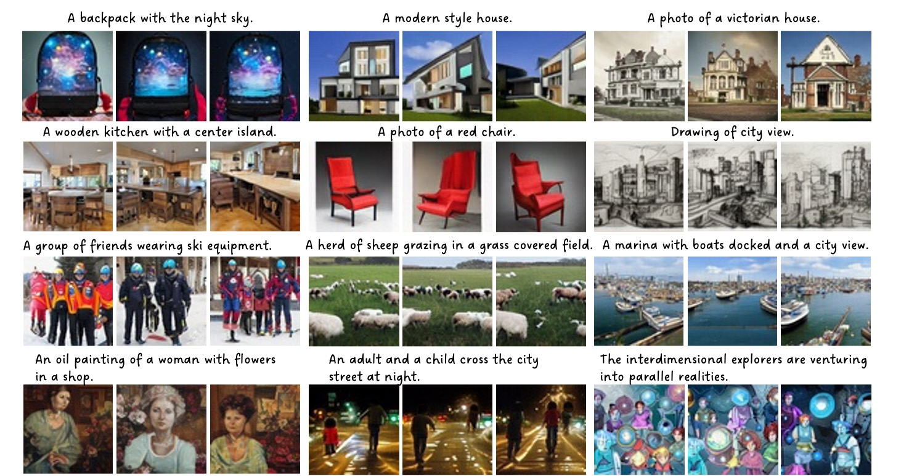

# Aurora -- An Open-sourced GAN-based Text-to-Image Generation Model

> **Exploring Sparse MoE in GANs for Text-conditioned Image Synthesis** <br>
> Jiapeng Zhu*, Ceyuan Yang*, Kecheng Zheng, Yinghao Xu, Zifan Shi, Yujun Shen <br>
> *arXiv preprint arXiv:2309.03904* <br>

[[Paper](https://arxiv.org/pdf/2309.03904.pdf)]

## TODO

- [x] Release inference code
- [x] Release text-to-image generator at 64x64 resolution
- [ ] Release models at higher resolution
- [ ] Release training code
- [ ] Release plug-ins/efficient algorithms for more functionalities

## Installation

This repository is developed based on [Hammer](https://github.com/bytedance/Hammer), where you can find more detailed instructions on installation. Here, we summarize the necessary steps to facilitate reproduction.

1. Environment: CUDA version == 11.3.

2. Install package requirements with `conda`:

    ```shell
    conda create -n aurora python=3.8  # create virtual environment with Python 3.8
    conda activate aurora
    pip install -r requirements/minimal.txt -f https://download.pytorch.org/whl/cu113/torch_stable.html
    ```

## Inference

First, please download the pre-trained model [here](https://hkustconnect-my.sharepoint.com/:u:/g/personal/jzhubt_connect_ust_hk/EZJRG5BV_URMjywZLcAW95YBKNQaD7M35Ba6PCHe_Gf16w?e=0n5BOm).

To synthesize an image with given text prompt, you can use the following command

```bash
python run_synthesize.py aurora_v1.pth 'A photo of a tree with autumn leaves'
```

To make interpolation between two text prompts, you can use the following command

```bash
python run_interpolate.py aurora_v1.pth \
       --src_prompt 'A photo of a tree with autumn leaves' \
       --dst_prompt 'A photo of a victorian house'
```

## Results

- Text-conditioned image generation



- Text prompt interpolation


## LICENSE

The project is under [MIT License](./LICENSE), and is for research purpose ONLY.

## Acknowledgements

We highly appreciate [StyleGAN2](https://github.com/NVlabs/stylegan2), [StyleGAN3](https://github.com/NVlabs/stylegan3), [CLIP](https://github.com/openai/CLIP), and [Hammer](https://github.com/bytedance/Hammer) for their contributions to the community.

## BibTeX

```bibtex
@article{zhu2023aurora,
  title   = {Exploring Sparse {MoE} in {GANs} for Text-conditioned Image Synthesis},
  author  = {Zhu, Jiapeng and Yang, Ceyuan and Zheng, Kecheng and Xu, Yinghao and Shi, Zifan and Shen, Yujun},
  journal = {arXiv preprint arXiv:2309.03904},
  year    = {2023}
}
```
