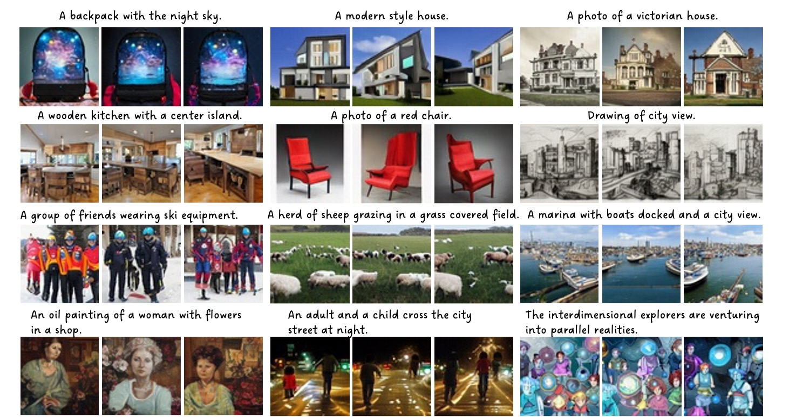

# Exploring Sparse MoE in GANs for Text-conditioned Image Synthesis


> **Exploring Sparse MoE in GANs for Text-conditioned Image Synthesis** <br>
> Jiapeng Zhu*, Ceyuan Yang*, Kecheng Zheng, Yinghao Xu, Zifan Shi, Yujun Shen <br>
> *arXiv preprint arXiv:* <be>
    
## Syntheized Results



## Code Coming Soon

## BibTeX

```bibtex
@article{zhu2022linkgan,
  title   = {Exploring Sparse {MoE} in GANs for Text-conditioned Image Synthesis},
  author  = {Zhu, Jiapeng and Yang, Ceyuan and Zheng, Kecheng and Xu, Yinghao and Shi, Zifan and Shen, Yujun},
  journal = {arXiv:},
  year    = {2023}
}
```
